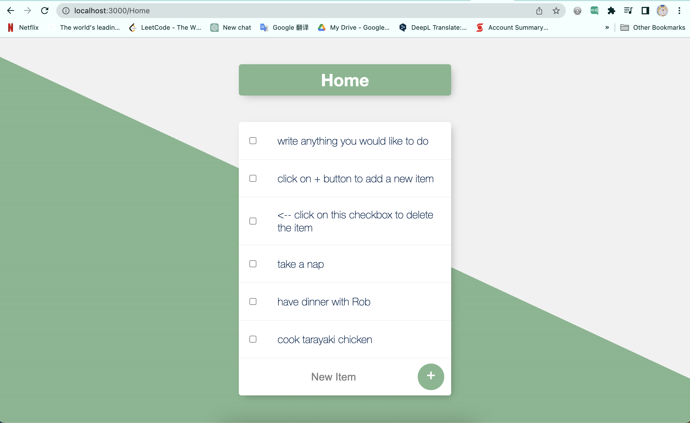

### To Do List


#### How to run it on local server
1. open the local mongodb server
    ```
    xiexiaoran@MacBook-Pro ~ % mongod --config /usr/local/etc/mongod.conf
    ```
2. open the mongodb shell(mongosh) to check the database
    ```
    xiexiaoran@MacBook-Pro ~ % mongosh 
    ```
    - clean the whole database
        ```
        todolistDB> db.dropDatabase()
        ```
    - more db instructions you should follow by documentation
3. run the app
    ```
    xiexiaoran@MacBook-Pro todolist-v2 % node app.js
    ```
4. open the browser and input the url
    ```
    http://localhost:3000/Home

    http://localhost:3000/NameWhatYouWant
    ```

